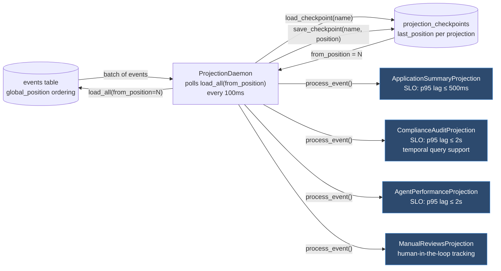
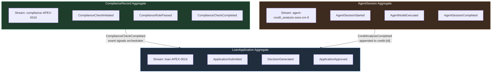

# Architecture Diagram

## Overview

This diagram shows the command-write path and projection read path of the event-sourced loan processing system. The PostgreSQL `events` table is the central persistence layer. All aggregate state is reconstructed from event streams on demand - there is no separate "current state" table. The `outbox` table is written inside the **same database transaction** as the event append, guaranteeing at-least-once downstream delivery without dual-write risk.

Three aggregate boundaries are shown, each with its own stream and consistency domain:

| Aggregate | Stream Format | Example | Consistency Concern |
|---|---|---|---|
| **LoanApplication** | `loan-{application_id}` | `loan-APEX-0016` | Lifecycle state machine: NEW → SUBMITTED → … → APPROVED/DECLINED |
| **ComplianceRecord** | `compliance-{application_id}` | `compliance-APEX-0016` | Rule evaluation: each rule evaluated once, hard-block semantics, completion accounting |
| **AgentSession** | `agent-{agent_type}-{session_id}` | `agent-credit_analysis-sess-cre-9` | Session lifecycle: context validation, model-version locking, terminal state enforcement |

Additional domain streams: `credit-{id}`, `fraud-{id}`, `docpkg-{id}`, `audit-{id}`.

---

## Core Invariants

- Event streams are append-only; updates happen by writing new events, never by mutating prior history.
- `stream_position` is unique per stream, and global ordering comes from the identity-backed `global_position`.
- Command handlers must load state, validate domain rules, and append atomically with the tracked `expected_version`.
- The outbox is written in the same transaction as the event append so downstream delivery can be retried safely.
- Projections are asynchronous, checkpointed, and restart from the last saved global position.

---

## Command-Write Path

```mermaid
flowchart TD
    CMD["Command\ne.g. SubmitApplication,\nCompleteComplianceCheck"]
    Handler["CommandHandler\n(Agent or API endpoint)"]
    StreamLoad["store.load_stream(stream_id)\nReturns ordered event list"]
    EventsRead[("events table\nSELECT WHERE stream_id\nORDER BY stream_position")]
    Agg["Aggregate.apply(event)\nRebuilds current state\nfrom event history"]
    Validate{"Validate / Decide\nassert_valid_transition()\nassert_can_approve()"}

    CMD -->|"inbound command"| Handler
    Handler -->|"load stream e.g.\nloan-APEX-0016"| StreamLoad
    StreamLoad -->|"SQL query"| EventsRead
    EventsRead -->|"replay each event\nthrough apply()"| Agg
    Agg -->|"state machine check\ndomain invariant guard"| Validate

    Validate -->|"new events +\nexpected_version=N"| AppendFn

    AppendFn["EventStore.append()"]

    subgraph TX["PostgreSQL Transaction — single atomic unit"]
        direction TB
        VersionCheck["event_streams\nSELECT ... FOR UPDATE\ncurrent_version vs expected_version\nstream_id + archived_at metadata\n❌ Mismatch -> OptimisticConcurrencyError"]
        InsertEvent["events table\nINSERT (stream_id, stream_position=N+1,\nevent_type, payload, recorded_at)"]
        InsertOutbox["outbox table\nINSERT (event_id, destination,\npayload) — SAME transaction"]
        UpdateVersion["event_streams\nUPDATE current_version = N+1"]

        VersionCheck --> InsertEvent
        InsertEvent --> InsertOutbox
        InsertOutbox --> UpdateVersion
    end

    AppendFn --> TX

    style TX fill:#1a2332,stroke:#4a90d9,stroke-width:2px,color:#fff
    style VersionCheck fill:#3d1f1f,stroke:#d94a4a,color:#fff
    style InsertOutbox fill:#1f3d2b,stroke:#4ab07d,color:#fff
```

---

## Projection Read Path (Async)

---

## Aggregate Boundaries

---

## Key Implementation Files

| Component | File |
|---|---|
| Event store (PostgreSQL + InMemory) | `ledger/event_store.py` |
| SQL schema (events, event_streams, outbox, checkpoints) | `sql/event_store.sql` |
| LoanApplicationAggregate | `ledger/domain/aggregates/loan_application.py` |
| ComplianceRecordAggregate | `ledger/domain/aggregates/compliance_record.py` |
| AgentSessionAggregate | `ledger/domain/aggregates/agent_session.py` |
| AuditLedgerAggregate | `ledger/domain/aggregates/audit_ledger.py` |
| Upcasters (CreditAnalysisCompleted v1→v2, DecisionGenerated v1→v2) | `ledger/upcasting/upcasters.py` |
| Projection base + lag tracking | `ledger/projections/base.py` |
| ProjectionDaemon with checkpointing | `ledger/projections/daemon.py` |
| ApplicationSummaryProjection | `ledger/projections/application_summary.py` |
| ComplianceAuditProjection (with temporal query + rebuild) | `ledger/projections/compliance_audit.py` |
| AgentPerformanceProjection | `ledger/projections/agent_performance.py` |
| ManualReviewsProjection | `ledger/projections/manual_reviews.py` |
| OCC concurrency test | `tests/test_concurrency.py` |
